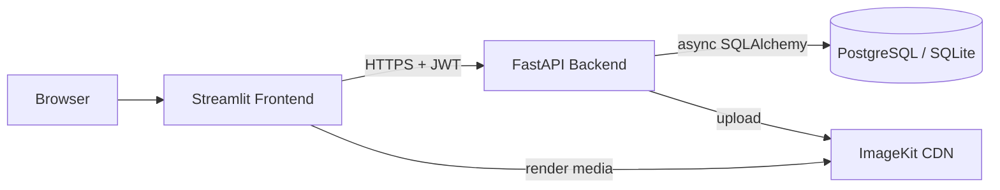

# 📸 MediaShare

<!-- TODO: replace with your actual Render URL once deployed -->
### 🔗 [**Check it out — Live Demo**](https://mediashare-3.onrender.com)
*(API docs / Swagger UI: [`/docs`](https://mediashare-1-a705.onrender.com/docs))*


A media-sharing app with a FastAPI backend and a Streamlit frontend. Users
sign up, upload photos/videos (stored and served via ImageKit's CDN), and
browse a paginated feed of everyone's posts.

Built primarily as a **backend showcase** — the focus is the API layer:
authentication, authorization, rate limiting, and data access, not the UI.

---

## ✨ Features

- **OAuth2 password flow + JWT auth** via [fastapi-users](https://fastapi-users.github.io/fastapi-users/), with **bcrypt** password hashing (via `pwdlib`) and a required, validated secret key
- **Per-user rate limiting** — max 15 uploads/minute, enforced with an in-memory sliding-window limiter (documented upgrade path to Redis for multi-worker deployments)
- **Paginated feed** — `GET /feed?page=&page_size=` (default 10/page), with total-page metadata
- **Ownership-enforced deletes** — only the original poster can delete a post (403 otherwise)
- **Async SQLAlchemy 2.0** data layer with a self-healing schema migration (adds new columns to an existing SQLite DB without wiping data)
- **Media CDN** — uploads go straight to [ImageKit](https://imagekit.io/), with on-the-fly image/video transformations at display time
- **Auto-generated interactive API docs** (OpenAPI/Swagger) at `/docs`, free from FastAPI

## 🏗️ Architecture



The frontend and backend are two independent processes talking over plain
HTTP — this is deliberate, so they can be deployed, scaled, and rate-limited
separately.

## 🧰 Tech stack

| Layer              | Tech                                                        |
|---------------------|--------------------------------------------------------------|
| API framework       | FastAPI                                                       |
| Auth                | fastapi-users (OAuth2 password flow + JWT)                    |
| Password hashing    | bcrypt via `pwdlib`                                            |
| ORM / DB driver     | SQLAlchemy 2.0 (async) — SQLite (dev) / PostgreSQL (prod)      |
| Media storage/CDN   | ImageKit.io                                                    |
| Frontend            | Streamlit                                                      |
| Deployment          | Render                                                         |

## 📁 Project structure

```
.
├── app.py                   # Streamlit frontend
├── pyproject.toml          # dependencies
├── backend/
│   ├── main.py                # FastAPI app + routes
│   ├── users.py                # auth: UserManager, JWT strategy, bcrypt hashing
│   ├── db.py                    # SQLAlchemy models, session, migrations
│   ├── schemas.py                 # Pydantic request/response models
│   ├── rate_limit.py                # per-user upload rate limiter
│   ├── imagekt.py                     # ImageKit client
│
├── .env.example
└── LICENSE
```

## 🚀 Getting started (local)

**Prerequisites:** Python 3.11+, an [ImageKit](https://imagekit.io/) account (free tier works).

```bash
git clone <your-repo-url>
cd mediashare

python -m venv venv
source venv/bin/activate      # Windows: venv\Scripts\activate

uv sync

cp .env.example .env          # then fill in your own values
```

Run the backend and frontend in **two separate terminals**, both from the
project root:

```bash
# Terminal 1 — API
uvicorn backend.main:app --reload

# Terminal 2 — UI
streamlit run app.py
```

- App: http://localhost:8501
- Interactive API docs: http://localhost:8000/docs

## ⚙️ Environment variables

| Variable                      | Required | Default                 | Notes                                                                 |
|--------------------------------|----------|---------------------------|-------------------------------------------------------------------------|
| `DATABASE_URL`                 | Yes      | —                          | Async SQLAlchemy URL. `sqlite+aiosqlite:///./app.db` locally, `postgresql+asyncpg://...` in production |
| `SECRET`                       | Yes      | —                          | 32+ char random string that signs JWTs. Generate: `python -c "import secrets; print(secrets.token_hex(32))"` |
| `ACCESS_TOKEN_EXPIRE_MINUTES`  | No       | `20`                       | JWT access-token lifetime                                                |
| `IMAGEKIT_PRIVATE_KEY`         | Yes      | —                          | From your ImageKit dashboard                                             |
| `IMAGEKIT_URL`                 | Yes      | —                          | Your ImageKit URL endpoint                                               |
| `API_BASE_URL`                 | No       | `http://localhost:8000`   | Frontend-only: where the Streamlit app finds the backend                 |

## 📡 API reference

| Method | Endpoint                | Auth        | Description                                  |
|--------|--------------------------|-------------|------------------------------------------------|
| POST   | `/auth/register`          | No          | Create an account (`username`, `password`)      |
| POST   | `/auth/jwt/login`          | No          | Log in, returns a bearer JWT                      |
| POST   | `/auth/jwt/logout`          | Yes         | Log out                                             |
| POST   | `/auth/forgot-password`      | No          | Request a password-reset token                        |
| POST   | `/auth/reset-password`        | No          | Reset password with a token                             |
| GET    | `/users/me`                     | Yes         | Get your profile                                         |
| PATCH  | `/users/me`                       | Yes         | Update your profile                                        |
| POST   | `/post`                             | Yes         | Upload media + caption — **rate-limited: 15/min**            |
| GET    | `/feed?page=&page_size=`              | Yes         | Paginated feed (default: page 1, 10/page)                       |
| DELETE | `/posts/{post_id}`                      | Yes (owner) | Delete your own post                                              |

Full schema and a try-it-out console: `/docs`.

## ☁️ Deployment (Render)

The app deploys as **two separate Render Web Services** from the same repo:
one for the FastAPI backend, one for the Streamlit frontend.

> **Why not SQLite in production?** Render's free web services have an
> **ephemeral filesystem** — persistent disks require a paid plan — so a
> SQLite file would get wiped on every restart/redeploy. Use Postgres in
> production; SQLite is still perfectly fine (and zero-setup) for local dev.

### 1. Push to GitHub
Render deploys from a connected Git repo.

### 2. Create a Postgres database
- Render Dashboard → **New → PostgreSQL** → note the **Internal Database URL**.
- Render's free Postgres instance works, but **expires 30 days after
  creation** (with a 14-day grace period to upgrade before deletion) — fine
  for a quick demo, but annoying for a portfolio piece you want to stay up.
  For something that doesn't need upkeep, point `DATABASE_URL` at a
  permanent free tier instead (e.g. [Neon](https://neon.tech) or
  [Supabase](https://supabase.com)) — same steps below either way.
- Whatever the source, rewrite the URL's scheme for the async driver:
  `postgresql://...` → `postgresql+asyncpg://...`

### 3. Deploy the backend
Render Dashboard → **New → Web Service** → select your repo.

| Setting        | Value                                                     |
|------------------|--------------------------------------------------------------|
| Environment       | Python 3                                                        |
| Build Command      | `uv sync`                        |
| Start Command       | `uvicorn backend.main:app --host 0.0.0.0 --port $PORT`             |
| Env vars              | `DATABASE_URL`, `SECRET`, `ACCESS_TOKEN_EXPIRE_MINUTES`, `IMAGEKIT_PRIVATE_KEY`, `IMAGEKIT_URL` |

Deploy, then note the resulting URL — something like
`https://mediashare-api.onrender.com`.

### 4. Deploy the frontend
Render Dashboard → **New → Web Service** → same repo.

| Setting        | Value                                                             |
|------------------|------------------------------------------------------------------------|
| Environment       | Python 3                                                                |
| Build Command      | `uv sync`                                        |
| Start Command       | `streamlit run app.py --server.port $PORT --server.address 0.0.0.0`        |
| Env vars              | `API_BASE_URL` = the backend URL from step 3                                 |

### 5. Verify
Open the frontend service's URL — that's your live demo link. Sign up,
upload something, confirm it shows in the feed.

**Free-tier gotchas to know about:**
- Free web services **spin down after 15 minutes idle** and take up to ~1
  minute to wake on the next request — the first visitor after a quiet
  spell will see a cold-start delay, not a broken app.
- Each workspace gets **750 free instance-hours/month** shared across
  services; past that, free services pause until next month.

